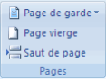
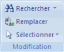

## Ajouter ou supprimer une page - Word - Office 2007

Lorsque le texte ou les graphismes occupent une page dans sa totalité, Microsoft Word insère un saut de page automatique et commence une nouvelle page. Cependant, vous pouvez à tout moment ajouter une nouvelle page vierge ou une page qui contient une mise en forme préconçue à votre document en cliquant sur **Nouvelle page**, dans le groupe **Pages** sur l'onglet **Insertion**. Vous pouvez également supprimer les pages inutiles en supprimant les sauts de page du document.

### Ajouter une page

1. Cliquez à l'emplacement où vous souhaitez insérer une nouvelle page dans un document.  
*REMARQUE*: La page insérée apparaîtra simplement avant votre emplacement de curseur.
2. Sous l'onglet **Insertion**, dans le groupe **Pages**, cliquez sur **Page vierge**.

### Ajouter une page de garde

Office Word 2007 contient une galerie de pages de garde prédéfinis. Choisissez une page de garde, puis remplacez le texte d'exemple par le vôtre.  

Les pages de garde sont toujours insérées au début d'un document, que le curseur s'affiche ou pas dans le document.

1. Sous l’onglet **Insertion**, dans le groupe **Pages**, cliquez sur **Page de garde**.

2. Cliquez sur une mise en page de garde à partir de la galerie d'options.  
Après avoir inséré une page de garde, vous pouvez remplacer le texte d'exemple par le vôtre.

*REMARQUES*:  

- Si vous insérez une autre page de garde dans le document, elle remplace la première que vous avez insérée.
- Si vous avez créé la page de garde dans une version antérieure de Word, vous ne pouvez pas la remplacer par une page de garde de la galerie Office Word 2007.
- Pour supprimer une page de garde, cliquez sur l'onglet **Insertion**, sur **Page de garde** dans le groupe **Pages**, puis sur **Supprimer la page de garde actuelle**.

### Supprimer une page

Vous pouvez supprimer une page vierge dans un document Word, avec une page vierge qui se produit à la fin du document, en supprimant des sauts de page. Vous pouvez également combiner deux pages en supprimant le saut de page qui les sépare.

#### Supprimer une page vierge

Assurez-vous d'être en *Mode Brouillon* (dans le menu **Affichage**, sur la barre d'état, cliquez sur **Brouillon**). Si les caractères non imprimables, tels que des marques de paragraphe (¶), ne
sont pas visibles, sous l'onglet **Accueil**, cliquez sur **Afficher tout¶**dans le groupe **Paragraphe**.

Pour supprimer une page vierge, sélectionnez le saut de page à la fin de la page, puis appuyez sur la touche **SUPPR**.

#### Supprimer une seule page de contenu

Vous pouvez sélectionner et supprimer une seule page de contenu n'importe où dans votre document.

1. Placez votre curseur n'importe où dans la page de contenu à supprimer.

2. Sous l'onglet **Accueil**, dans le groupe **Modification**, cliquez sur la flèche en regard de **Rechercher**, puis sur **Atteindre**.

3. Tapez **\page** puis cliquez sur **Atteindre**.
Le contenu de la page est sélectionné.

4. Cliquez sur **Fermer** puis appuyez sur **SUPPR**.

#### Supprimer une page vierge à la fin d'un document

Assurez-vous d'être en *Mode Brouillon* (dans le menu **Affichage**, sur la barre d'état, cliquez sur **Brouillon**). Si les caractères non imprimables, tels que des marques de paragraphe (¶), ne sont pas visibles, sous l'onglet **Accueil**, cliquez sur **Afficher tout¶** dans le groupe **Paragraphe**.

Pour supprimer une page vierge à la fin du document, sélectionnez le saut de page ou toutes les marques de paragraphe (¶) à la fin du document, puis appuyez sur la touche **SUPPR**.